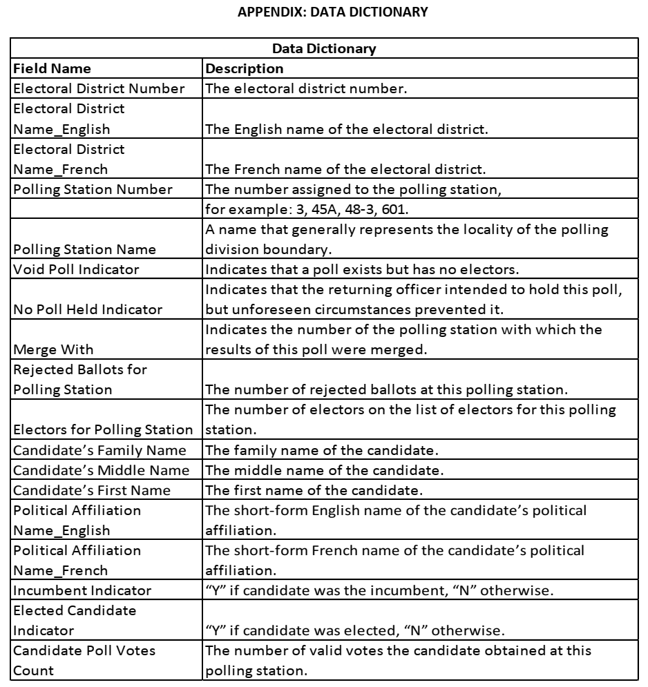

### Descriptive Analysis
#### Background
The Canadian Federal Election of 2015 was overseen and administered by Elections Canada. There are 338 electoral districts in Canada, each with several candidates (one for each party and independents) running to win the right to represent that electoral district.
Each Electoral district is divided in to a number of polling stations (locations at which voters place their votes). After the election, each candidate is interested in the poll by poll results to determine which areas of their district gave them strong support and which gave them weak support. They can then use this information to help determine advertising expenditures in subsequent elections.
#### Tasks
1. Identify the feature type of each column in the dataset.
2. Manipulate the spreadsheet using pivot table (or another technique) to generate a
table that will allow the analysis of each district. Remember, the purpose of analysis is to make the data comprehensible, so make sure your work is clear and easy to understand. As shown in class with Goalies, you should end up with a spreadsheet that looks like this:

3. Determine what to do with unusual results. For example, in the figure above, Polling
Station 2 has no registered electors. This is because it is a “void poll” (per the data dictionary in the appendix). Should this be suppressed? Included? Selectively included? There will be some polls with no electors, but still achieved votes. These are likely advance polls. How should they be dealt with? For all such unusual results describe how you have chosen to deal with them and why.
4. At the bottom of the table in the spreadsheet, summarize the results of the vote (number of votes, percentage of vote, percentage of voters casting a ballot (i.e. “turn out”), and percentage of total electors, etc.) for the entire electoral district. You should include the three main measures of location and the five main measures of dispersion.
